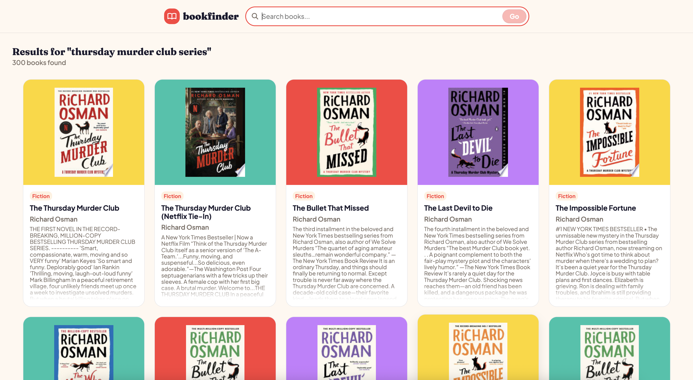
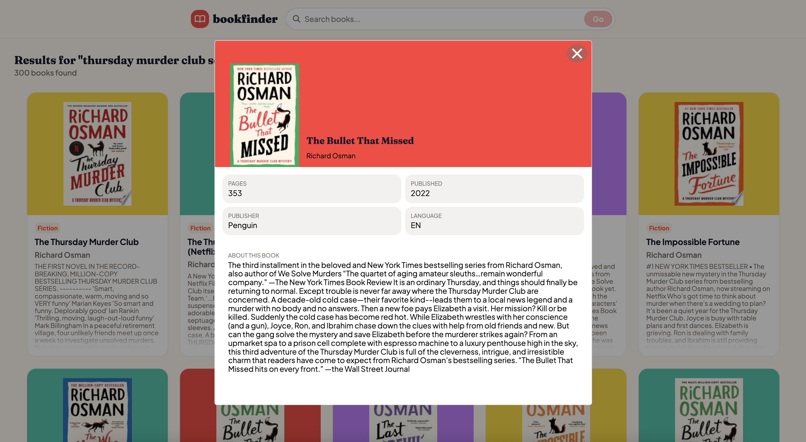

# 📚 Google Books

## Snippets

- **App Preview:**

Search for your favourite books using the Google Books database






---

## Requirements / Purpose

### MVP & Purpose

This frontend application consumes the Google Books API to render a grid of relevant book search results. Clicking on any book tile triggers a detailed modal view with additional metadata.

### Tech Stack Used & Why

- **React & Vite:** Fast development build tool combined with modern React components for seamless, real-time UI updates.
- **SCSS:** Provides modular, maintainable, and reusable styling through variables, and mixins.
- **React Testing Library:** Ensures UI components render accurately and handle API responses or fallback states correctly.
- **JavaScript (ES6+):** Client-side data fetching and dynamic state management.

---

## Run Steps

### Prerequisites

- **Node.js:** v18+
- **npm:** v9+

### Environment Variables

Create a `.env` file in the root directory:

```env
VITE_GOOGLE_API_KEY=your-google-api-key
```

| Variable              | Description    | Example / Default |
| :-------------------- | :------------- | :---------------- |
| `VITE_GOOGLE_API_KEY` | Google API Key | `AIzaSy...`       |

### Installation & Local Development

```bash
# Install dependencies
npm install

#Start the Vite development server
npm run dev
```

### Running Tests

```bash
# Running unit test suites
npm run test
```

---

## Design Goals / Approach

- **User Experience (UX):** Created a clean grid layout with modal overlays to keep users in context without needing page reloads.
- **Asynchronous State Management:** Handled API loading, empty search results, and error states gracefully to inform the user during network requests.
- **Modular SCSS:** Organized styles into reusable variables and component-specific stylesheets for consistent typography and spacing.

---

## Features

- **Live Book Search** - instant query fetching powered by the Google Books REST API.
- **Mobile-First Design** - this website has been built with a responsive, mobile-first layout.
- **Book Grid:** Search results displayed in an adaptive grid layout.
- **Search Result Pagination** - enables users to navigate through additional results pages beyond the initial query limit.
- **Detailed Book Modal** - in-depth view displaying additional book ratings, information, and publication details.
- **API State Handling** - specific views displayed while waiting for the response from the API, if there are no books returned from the API call, or if there was an error during the API call.

---

## Known Issues

- The Google Books API occasionally returns missing image thumbnails or empty description fields for niche titles (handled via fallback placeholders).
- API rate limits may trigger temporary errors if search queries are fired too rapidly without debouncing.

---

## What Did You Struggle With?

- **Handling Edge Cases:** Handling missing or incomplete metadata from Google Books API (e.g., missing image thumbnails or ratings) required adding defensive rendering logic and default fallback values in React components.

---

## Future Goals

- **Debounced Search Input:** Implement a custom debounce hook to optimize API calls as the user types.
- **Favourite List:** Allow users to bookmark books to a personal reading list stored in `localStorage`.
- **Additional Filtering:** Incorporate search parameters (e.g. category, language) to narrow down search results.

---

## License

This project is licensed under the MIT License. You are free to modify, distribute, and use it commercially, provided attribution is maintained and liability is disclaimed.
